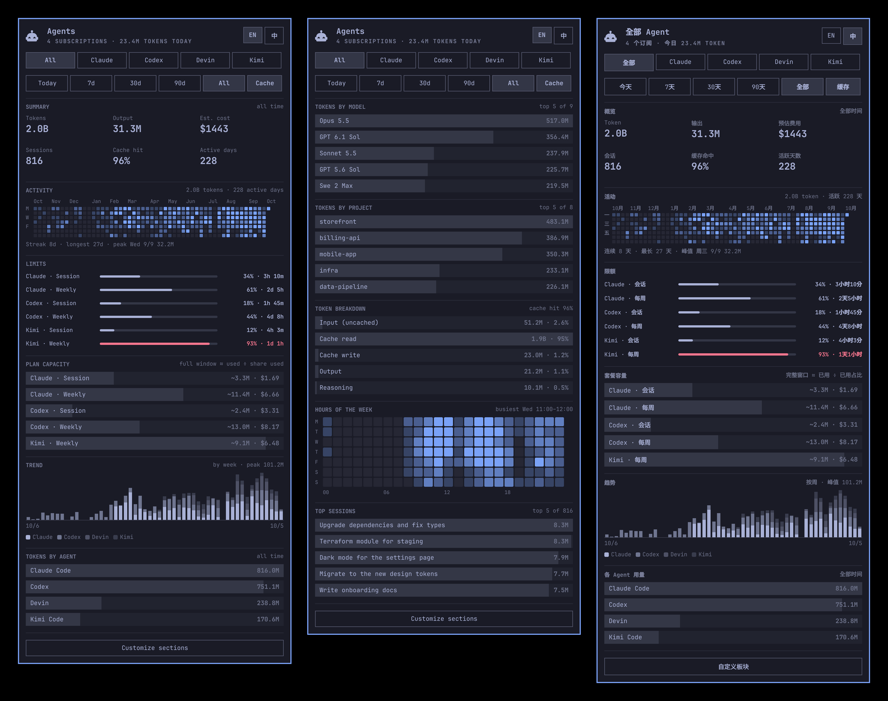

# Agent Ledger

One bar icon and one page for every AI coding agent on the machine: what the
plan still allows, a year of activity, what it would have cost at list prices,
and where the tokens went — by agent, model, project, hour and session.

An [Omarchy](https://omarchy.org) bar widget. The page switches between English
and Chinese ([中文说明](README.zh-CN.md)).



## Install

```bash
omarchy plugin add https://github.com/BeforeUgone123/omarchy-agent-ledger --enable
```

It needs `python3` and `jq`, which Omarchy already has. Nothing is installed
outside the plugin folder, and there is no install script and no `sudo`.

It sits beside Omarchy's own Agents widget rather than replacing it. To keep
only this one:

```bash
omarchy plugin disable omarchy.agents
```

Remove it with `omarchy plugin remove beforeugone.agents`. What it wrote is under
`~/.local/state/omarchy/agents/` (`index/`, `history/`, and `usage/devin.json`,
`usage/kimi.json`) and can be deleted.

## What it shows

Every enabled agent shares one page. Two chip rows scope everything below them:

- **Focus** — `All` plus one chip per agent (`h`/`l` or click) narrows the page
  to a single agent.
- **Range** — `Today`, `7d`, `30d`, `90d`, `All`. `Cache` switches whether
  token totals count cache reads; off leaves only the new work.

The sections, in their default order:

- **Summary** — tokens, output, estimated cost, sessions, cache hit rate and
  active days for the range, each with its change against the period before.
- **Activity** — a GitHub-style calendar of daily tokens, with the active-day
  count, current and longest streak, and the peak day. Hover a day for the
  split by agent; click one to scope the page to that day.
- **Limits** — one line per allowance: whose it is, a meter, the percentage
  used, and the time until it resets. Prepaid agents show remaining credit.
  Sign-in and endpoint problems follow in a card.
- **Plan capacity** — what each allowance actually amounts to: the tokens and
  list-price cost spent inside a limit window, divided by the share of the
  window they used up. 14% of the week costing $29 puts the full week near
  $209. Hover for the working.
- **Trend** — stacked columns over the range, one segment per agent.
- **Tokens by agent** — click a row to focus that agent.
- **Tokens by model** — hover for the input / output / cache split.
- **Tokens by project** — by working directory; click a row to filter the page
  to that project. While a filter is on, a chip under the range row names it.
- **Token breakdown** — uncached input, cache read, cache write, output,
  reasoning.
- **Hours of the week** — weekday by hour.
- **Top sessions** — the heaviest sessions in the range; hover for agent,
  project, start, duration, peak context and cost.

**Customize sections** at the bottom reorders and hides sections. **EN / 中**
in the top right corner switches the language. Both are saved.

Bar icon: left click opens the panel, right click launches an agent, middle
click steps the focus. In the panel `h`/`l` change focus, `j`/`k` scroll, `r`
refreshes, Esc closes. From a script:
`omarchy-shell beforeugone.agents <open|close|toggle|refresh|next|status>`.

## Agents

| Agent | Limits | Token detail read from |
|---|---|---|
| Claude Code | session and weekly windows, from Omarchy's collector | `~/.claude/projects/**/*.jsonl` |
| Codex | session and weekly windows, from Omarchy's collector | `~/.codex/sessions/**/*.jsonl` |
| Devin | none: Devin has no usage API | `~/.local/share/devin/cli/transcripts/*.json` |
| Kimi Code | windows and balance, from the collector in `bin/collect-kimi` | `~/.kimi-code/sessions/**/wire.jsonl` |
| Fireworks | prepaid balance, from Omarchy's collector | — (day totals only) |

An agent appears once it has been used on this machine. Any other agent with an
Omarchy usage collector shows its limits and day totals too; model, project,
hour and session detail needs a log adapter (see below).

## What it reads and what it sends

Everything is computed on this machine. The plugin reads the agents' own
session logs, listed above, and keeps an index under
`~/.local/state/omarchy/agents/index/`: token counts, model names, working
directories, and one title per session (where an agent keeps no title, the
first prompt stands in). No other message content is stored, and nothing is
uploaded.

Limits are the one thing that cannot be read locally. Omarchy's collectors ask
each provider for them using the sign-in its CLI already has, exactly as the
built-in Agents widget does. `bin/collect-kimi` does the same for Kimi:
it reads the token `kimi login` stored under `~/.kimi-code/credentials/` and
calls Kimi's usage endpoint, and nothing else. Without a sign-in an agent still
shows its token detail, with a note that limits are unavailable.

Cross-device aggregation is off unless you set `syncMode`; when on, it writes a
snapshot of usage totals into a folder you choose.

## Settings

Settings live in the widget's entry in `~/.config/omarchy/shell.json`, and in
Omarchy's settings panel:

| Key | Default | What it does |
|---|---|---|
| `language` | `"English"` | `"Chinese"` draws the panel in Chinese; the `EN` / `中` switch sets it |
| `sections` | all eleven, in the order above | Which sections draw, and in what order |
| `defaultRange` | `"All"` | The range selected when the panel opens |
| `heatmapWeeks` | `53` | Weeks in the activity calendar (4–53); fewer weeks draw larger cells |
| `heatmapTint` | `"Foreground"` | `"Accent"` draws the calendar in the theme accent |
| `panelWidth` | `460` | Panel width (340–720) |
| `listRows` | `5` | Rows in the model, project and session lists (1–12) |
| `refreshIntervalSec` | `900` | How often limits and logs are re-read |
| `syncMode`, `syncDir`, `syncFileName`, `syncDeviceId` | off | Merge usage snapshots from other machines through a synced folder |

```bash
omarchy bar set beforeugone.agents language Chinese
omarchy bar set beforeugone.agents refreshIntervalSec 300 --json
omarchy bar set beforeugone.agents providers '{ "kimi": { "enabled": false } }' --json
```

Numbers need `--json`. `providers.<id>.enabled` hides an agent and skips its
collector. Colours, fonts and spacing follow the Omarchy theme.

## Cost

`pricing.json` is the providers' published list prices, in USD per million
tokens: Anthropic, OpenAI, Google, xAI, Moonshot (Kimi), DeepSeek and
Cognition's SWE-2. The file names the page each provider's prices came from and
the date they were read (`sources`, `checked`), and its `notes` say where a
price is a choice rather than a fact. A model set to `null`, or missing, is
unpriced and left out of cost figures; the summary says how many are.

Agents log more than the provider's model id, so a name is matched after
peeling off what was appended: a dated snapshot (`claude-haiku-4-5-20251001`),
a reasoning effort (Devin's `claude-opus-5-5-high`, `swe-2-max`), a speed tier
(`-fast`, `-priority`, which also applies the model's `fastMultiplier`), and
Devin's dashes for dots (`gpt-5-6-sol`). An exact entry always wins.

To change a price or add a model, write `pricing.local.json` next to it, in
the same shape (`{ "models": { "<id>": { "input": …, "output": … } } }`). It
is laid over the shipped list and survives updates. Edits apply on the next
refresh.

Costs are an estimate at list prices, not a bill: a subscription, a relay's
own rates or a promotion make the real figure different. Two things the list
does not model: the higher rates above a provider's long-context threshold
(OpenAI 272K input tokens, Google and xAI 200K), and DeepSeek's half-price
off-peak hours.

## How it works

`Panel.qml` owns the bar button and the page; `Main.qml` loads the data;
`Heatmap.qml` and `HourGrid.qml` are the two grids; `Strings.js` is the Chinese
text. The page draws from two sources:

- **Usage records**, one JSON file per agent in
  `~/.local/state/omarchy/agents/usage/`. `bin/usage-update` regenerates them:
  it runs Omarchy's `omarchy-agent-usage-update` and then the `collect-<agent>`
  scripts beside it, for agents Omarchy has no collector for. Records are the
  only source for limits, balances and sign-in state.
- **The index**, built by `bin/usage-index` (Python, standard library only)
  from the raw session logs. It reads only what is new into `usage.db`, then
  writes `cube.json`: hourly totals in local time by agent, model, project and
  session. An agent with logs but no collector, like Devin, gets its usage
  record from the index.

Adding an agent's detail is adding an adapter class to `bin/usage-index`;
adding its limits is adding a `bin/collect-<agent>` that prints a usage record.
Deleting the `index` directory is safe: the next refresh rebuilds it.

Agents without an adapter keep their day totals in
`~/.local/state/omarchy/agents/history/days.json`, because a record carries
only seven days.

## Credits

Derived from the Agents plugin that ships with
[Omarchy](https://github.com/omacom/omarchy), under the MIT license. See
[LICENSE](LICENSE) and [NOTICE.md](NOTICE.md).
