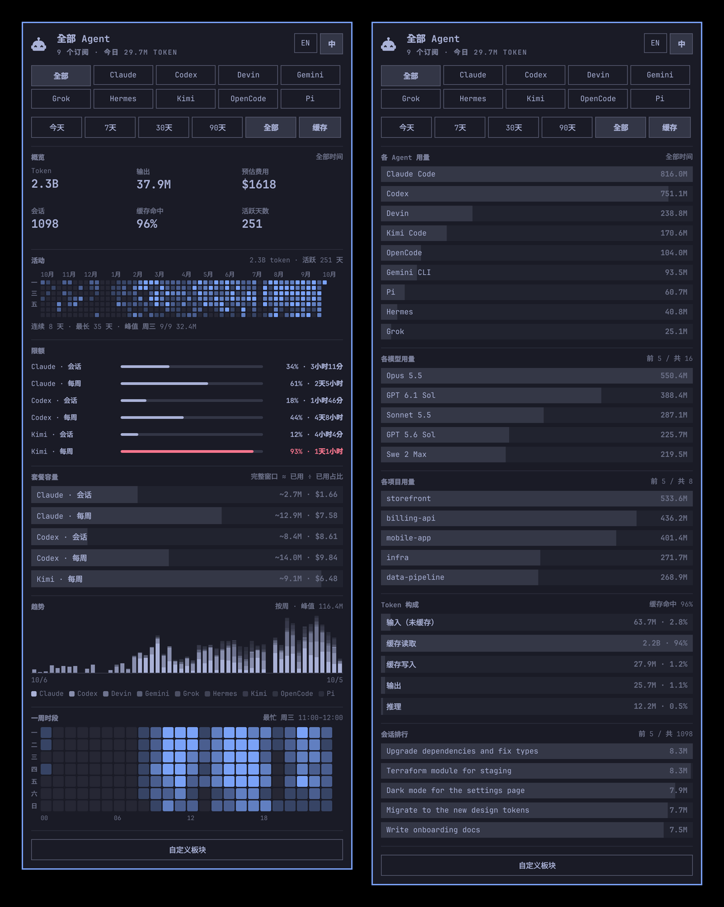

# BF-Agent-Ledger

一个状态栏图标、一个页面，汇总这台机器上所有 AI 编程 Agent 的用量：套餐还剩多少、
一整年的活动、按官方标价折算的费用，以及 token 花在了哪里——按 Agent、模型、项目、
时段和会话拆分。

这是一个 [Omarchy](https://omarchy.org) 状态栏组件，界面可在中文和英文之间切换
（[English](README.md)）。



## 安装

```bash
omarchy plugin add https://github.com/BeforeUgone123/BF-Agent-Ledger --enable
```

依赖 `python3` 和 `jq`，Omarchy 自带。插件不会在自己的目录之外安装任何东西，
没有安装脚本，也不需要 `sudo`。

它和 Omarchy 自带的 Agents 组件并存，不会替换它。只想保留这一个的话：

```bash
omarchy plugin disable omarchy.agents
```

卸载：`omarchy plugin remove beforeugone.agents`。它写入的数据在
`~/.local/state/omarchy/agents/` 下（`index/`、`history/`，以及 `usage/` 里带有
`"source": "beforeugone.agents/index"` 的记录和 `usage/kimi.json`），可以直接删除。

## 页面内容

所有启用的 Agent 共用一个页面，顶部两行按钮决定下面所有内容的范围：

- **聚焦**——“全部”加每个 Agent 一个按钮（`h`/`l` 或点击），把页面收窄到单个 Agent。
- **时间范围**——今天、7天、30天、90天、全部。“缓存”决定 token 总量是否计入缓存读取，
  关掉后只剩新产生的用量。

默认顺序的各个板块：

- **概览**——所选范围内的 token、输出、预估费用、会话数、缓存命中率和活跃天数，
  并和上一个同等长度的时段对比。
- **活动**——GitHub 风格的每日 token 日历，附活跃天数、当前和最长连续天数、峰值日。
  悬停看各 Agent 的占比，点击某一天把整页限定到那一天。
- **限额**——每个额度一行：属于谁、进度条、已用百分比、距离重置的时间。
  预付费的 Agent 显示剩余余额。登录或接口问题会在下方的卡片里说明。
- **套餐容量**——每个额度实际相当于多少：限额窗口内花掉的 token 和标价费用，
  除以它们占用的窗口比例。一周用了 14%、花了 $29，整周大约就是 $209。悬停看算式。
- **趋势**——所选范围内的堆叠柱状图，每个 Agent 一段。
- **各 Agent 用量**——点击某行聚焦该 Agent。
- **各模型用量**——悬停看输入 / 输出 / 缓存的拆分。
- **各项目用量**——按工作目录统计；点击某行把整页筛选到该项目。
  筛选生效期间，时间范围下方会有一个提示条写明项目名。
- **Token 构成**——未缓存输入、缓存读取、缓存写入、输出、推理。
- **一周时段**——星期 × 小时。
- **会话排行**——范围内用量最大的会话；悬停看 Agent、项目、开始时间、时长、
  上下文峰值和费用。

底部的**自定义板块**可以调整顺序、隐藏板块；右上角的 **EN / 中** 切换语言。两者都会保存。

状态栏图标：左键打开面板，右键启动 Agent，中键切换聚焦。面板内 `h`/`l` 切换聚焦，
`j`/`k` 滚动，`r` 刷新，Esc 关闭。脚本调用：
`omarchy-shell beforeugone.agents <open|close|toggle|refresh|next|status>`。

## 支持的 Agent

| Agent | 限额 | token 明细读取自 |
|---|---|---|
| Claude Code | 会话和每周窗口，来自 Omarchy 的采集器 | `~/.claude/projects/**/*.jsonl` |
| Codex | 会话和每周窗口，来自 Omarchy 的采集器，经 `bin/collect-codex` 运行 | `~/.codex/sessions/**/*.jsonl` |
| OpenCode | — | `~/.local/share/opencode/opencode.db` |
| Pi | — | `~/.pi/agent/sessions/**/*.jsonl`（以及 oh-my-pi 的 `~/.omp`） |
| Hermes | — | `~/.hermes/state.db`，以及各 profile 的 |
| Gemini CLI | — | `~/.gemini/tmp/*/chats/` |
| Grok | — | `~/.grok/sessions/`：`usage.json`，旧版本则读取轮次日志 |
| Kigi | — | `~/.kigi/sessions/**/updates.jsonl` |
| Devin | 无：Devin 没有用量接口 | `~/.local/share/devin/cli/transcripts/*.json` |
| Kimi Code | 窗口和余额，来自 `bin/collect-kimi` | `~/.kimi-code/sessions/**/wire.jsonl` |
| Fireworks | 预付费余额，来自 Omarchy 的采集器 | —（只有每日总量） |

某个 Agent 在这台机器上用过之后才会出现。OpenCode、Pi 和 Hermes 调用的是其他
服务商的模型：它们的 token 记在实际使用的工具名下，模型名按工具记录的原样显示。

**来自其他插件的限额。** 面板会显示 `~/.local/state/omarchy/agents/usage/`
里的每一条用量记录，不管是谁写的。所以为 Omarchy 自带 Agents 面板写的采集器插件
（Grok、Hermes、Gemini、Copilot、Cursor、Z.ai 等）在这里同样生效；本插件没有
适配器的 Agent，也能通过这种方式显示限额和每日总量。

**各适配器的验证程度。** Claude Code、Codex、Devin 和 Kimi Code 用真实日志逐项
核对过。OpenCode、Pi、Hermes、Gemini CLI、Grok 和 Kigi 依据各项目自己的源码或
文档格式编写，并用按该格式构造的文件测试过，但还没有在真正消耗过 token 的会话上
跑过。Hermes、Grok 和 Kigi 保存的是每个会话或每轮的总量而不是每次请求，所以它们的
按小时明细只能精确到这个粒度，请求数实际是轮数，一轮的数字包含它启动的子 Agent。

## 读取什么、发送什么

所有计算都在本机完成。插件读取上表列出的 Agent 自身的会话日志，并在
`~/.local/state/omarchy/agents/index/` 下保存一份索引：token 数、模型名、工作目录，
以及每个会话一个标题（Agent 没有标题时用第一条提问代替）。不保存其他对话内容，
也不上传任何东西。

只有限额无法从本地读到。Omarchy 的采集器会用各家 CLI 已有的登录状态向服务商查询，
和自带的 Agents 组件完全一样。`bin/collect-kimi` 对 Kimi 做同样的事：读取
`kimi login` 存在 `~/.kimi-code/credentials/` 下的令牌，请求 Kimi 的用量接口，
仅此而已。`bin/collect-codex` 原样运行 Omarchy 自带的 Codex 采集器，只改了读取
Codex app-server 应答的方式（自带版本偶尔会丢掉应答，报 "account/read" 不可用），
请求的内容和自带版本完全相同。没有登录时，Agent 仍会显示 token 明细，并提示限额不可用。

跨设备汇总默认关闭，除非设置 `syncMode`；开启后会把用量总计的快照写入你指定的文件夹。

## 设置

设置保存在 `~/.config/omarchy/shell.json` 里这个组件的条目中，也可以在 Omarchy
的设置面板里修改：

| 键 | 默认值 | 作用 |
|---|---|---|
| `language` | `"English"` | 设为 `"Chinese"` 显示中文；面板上的 `EN` / `中` 开关改的就是它 |
| `sections` | 全部十一个，按上面的顺序 | 显示哪些板块、按什么顺序 |
| `defaultRange` | `"All"` | 打开面板时选中的时间范围 |
| `heatmapWeeks` | `53` | 活动日历的周数（4–53），周数越少格子越大 |
| `heatmapTint` | `"Foreground"` | 设为 `"Accent"` 用主题强调色绘制日历 |
| `panelWidth` | `460` | 面板宽度（340–720） |
| `listRows` | `5` | 模型、项目、会话列表的行数（1–12） |
| `refreshIntervalSec` | `900` | 多久重新读取一次限额和日志 |
| `syncMode`、`syncDir`、`syncFileName`、`syncDeviceId` | 关闭 | 通过同步文件夹合并其他机器的用量快照 |

```bash
omarchy bar set beforeugone.agents language Chinese
omarchy bar set beforeugone.agents refreshIntervalSec 300 --json
omarchy bar set beforeugone.agents providers '{ "kimi": { "enabled": false } }' --json
```

数字需要加 `--json`。`providers.<id>.enabled` 用来隐藏某个 Agent 并跳过它的采集器。
颜色、字体和间距跟随 Omarchy 主题。

## 费用

`pricing.json` 是各家公开的官方标价，单位为每百万 token 的美元价格：Anthropic、
OpenAI、Google、xAI、Moonshot（Kimi）、DeepSeek 以及 Cognition 的 SWE-2。
文件里写明了每家价格的来源页面和查询日期（`sources`、`checked`），`notes` 里说明了
哪些价格是取舍而非事实。设为 `null` 或没有收录的模型不计入费用，概览里会显示有几个。

Agent 记录的模型名比官方型号多一些后缀，匹配时会逐个去掉：日期快照
（`claude-haiku-4-5-20251001`）、推理强度（Devin 的 `claude-opus-5-5-high`、
`swe-2-max`）、速度档（`-fast`、`-priority`，同时套用该模型的 `fastMultiplier`），
以及 Devin 用连字符代替小数点的写法（`gpt-5-6-sol`）。完全匹配的条目优先。

想改价格或添加模型，在同目录下写一个 `pricing.local.json`，格式相同
（`{ "models": { "<id>": { "input": …, "output": … } } }`）。它会覆盖官方表，
更新插件时不会被替换。修改在下次刷新时生效。

费用是按标价的估算，不是账单：订阅、中转站自己的价格或促销都会让实际花费不同。
有两点没有建模：超过长上下文阈值后的更高单价（OpenAI 为 272K 输入 token，
Google 和 xAI 为 200K），以及 DeepSeek 非高峰时段的半价。

## 致谢

改自 [Omarchy](https://github.com/omacom/omarchy) 自带的 Agents 插件，MIT 许可。
见 [LICENSE](LICENSE) 和 [NOTICE.md](NOTICE.md)。
